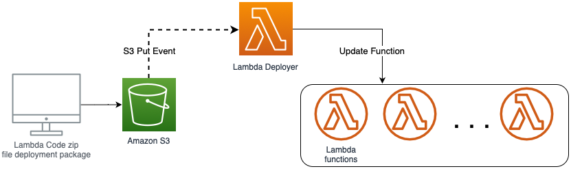

# S3-to-Lambda-Deployer

This GitHub repository contains code and documentation for a Lambda function that acts as a trigger to automatically update (self and) other Lambda functions whenever a deployment zip file has been uploaded to an Amazon S3 bucket. This is a useful feature for automating the deployment and management of Lambda functions in your AWS environment.

# Serverless Framework
This project uses [Serverless framework](https://www.serverless.com/framework/docs/getting-started) for Lambda deployment and S3 event trigger. 
Update `serverless.yml` file with the following configuration:
- S3 bucket name. Replace *lambdadeploymentbucket* with your bucket name
- Update region of your deployment by updating *region:* parameter
 
 

# Installation

`export AWS_DEFAULT_PROFILE=XXX` OR `export AWS_ACCESS_KEY_ID=XXX` and `AWS_SECRET_ACCESS_KEY=XXX`

`git clone git@github.com:husyn/S3-to-Lambda-Deployer.git`

`cd S3-to-Lambda-Deployer`

`npm install`

`sls deploy`

# License

This project is licensed under the MIT License.